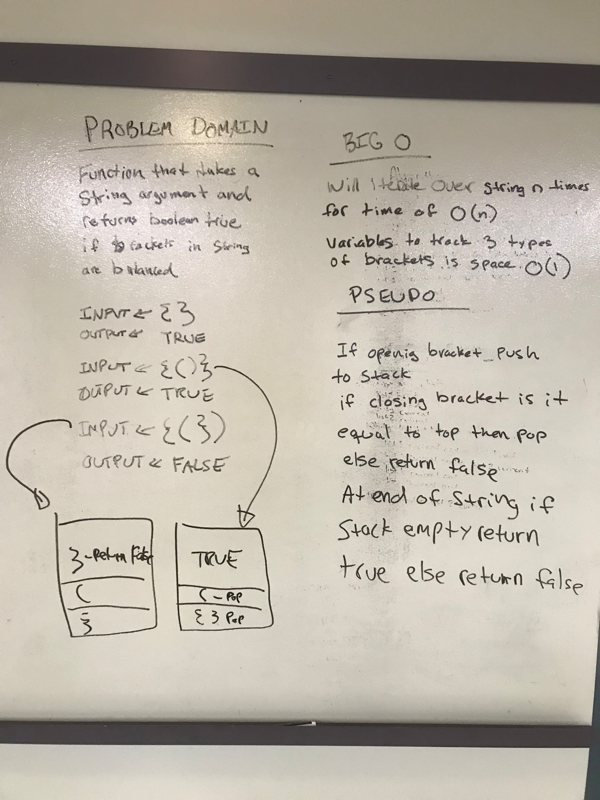

# Challenge Summary
Multi-bracket Validation

## Challenge Description
Your function should take a string as its only argument and should return a boolean representing whether or not the brackets in the string are balanced. There are 3 types of brackets:

- Round Brackets : ()
- Square Brackets : []
- Curly Brackets : {}

## Approach & Efficiency

## Code
[See the MultiBracketValidation.java Class for code challenge 13](src/main/java/code/challenges/MultiBracketValidation.java)

[See the tests](src/test/java/code/challenges/MultiBracketValidationTest.java)

## Solution

