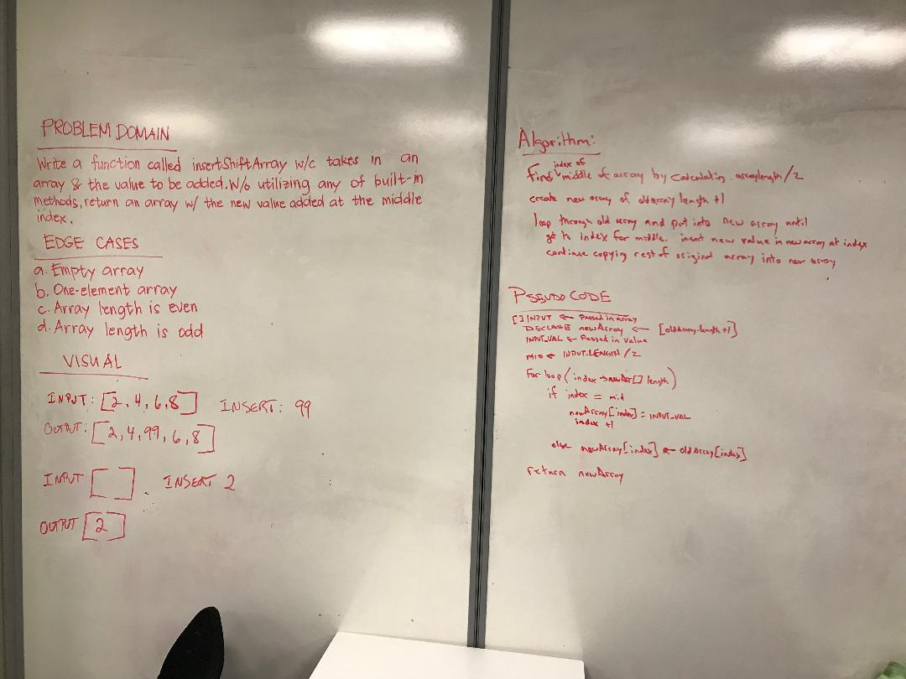

# Challenge Summary
Insert an integer in the middle of an array

## Challenge Description
Write a function called insertShiftArray which takes in an array and the value to be added. Without utilizing any of the built-in methods available to your language, return an array with the new value added at the middle index.

## Approach & Efficiency
Use a for loop to iterate over new array and insert values from old array and the new value

## Code
[See the code](src/main/java/code/challenges/ArrayShift.java)

[See the tests](src/test/java/code/challenges/ArrayShiftTest.java)

## Solution
