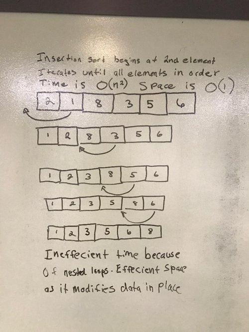

# Lecture Notes: Insertion Sort

The insertion sort algorithm is an iteration over the dataset where one element is mover per iteration. The element, if not already in order, is moved and inserted at the appropriate location. After all elements that were not in order have been moved the resulting dataset will be in order.

The advantages of an insertion sort is its simplicity. It does not require much code. It is very space efficient , O(1), as it modifies the dataset in place. It is also efficient when working with small datasets. However, because of the nested loop it uses its time efficiency, O(n - squared) is poor it is inefficient for large datasets.
***

Todays learning objective is to learn how an insertion sort works. We will analyze time and space complexity to understand when an insertion sort should be used and when it should not. At the end of this lesson the student will know hot to pseudo code and code a solution for an insertion sort.

- Review diagram with students
- Analyze time complexity
- Analyze space complexity
- Pseudo code solution
- Have student code solution
- have students write tests for happy path and edge cases.

***

Algorithm
- Iterate over the array in a for loop that starts at array element 1 as the element at 0 will never be moved.

- In the for loop set j to the element before the element at i
  - int j = i - 1;

- Save element at i to variable
  - int temp = arr[i];

- In the for loop run a while loop that runs only if an element is less than the element preceding it and j >= 0

  - In the while loop set element at j + 1 to element at j
  - decrement j
- After wile loop ends insert saved array element to array at j + 1
  - arr[j + 1] = temp;
***

Pseudocode:

For the length of the input array, starting at index 1
- set j = index - 1
- save off array element at current index location

- While j >= 0 and saved array element value < current array value at j
  - set element at j + 1 = element at J
  - decrement j

- After wile loop ends insert saved array element to array at j + 1

Return the array
***

Readings and References
Watch
- https://www.youtube.com/watch?v=lCDZ0IprFw4

Read
- https://www.interviewbit.com/tutorial/insertion-sort-algorithm/
- https://www.geeksforgeeks.org/insertion-sort/
