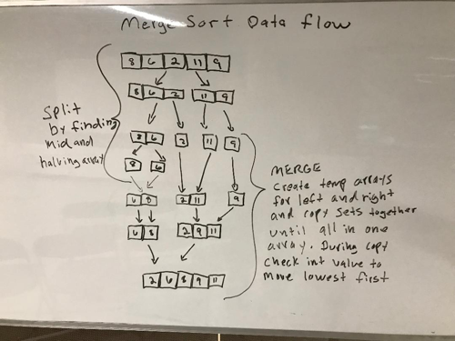

# Lecture Notes: Merge Sort

The algorithm is breifly: Divide the dataset into equal halves until at atomic values. Combine them sorting each part as they are combined.

Merge sorts work well for sorting linked lists. In a linked list items can be inserted as O(1) time and O(1) space as items can be inserted where necessary using pointers and without allocating additional storage as the nodes being sorted already exist in memory. Overall though time complexity is O(n log n) for a merge sort as it still needs to divide and then add n steps to merge them back together.
***

Todays learning objective is to learn how a merge sort works. We will analyze time and space complexity to understand when a merge sort should be used and when it should not. At the end of this lesson the student will know how to pseudo code and code a solution for a merge sort.

- Review diagram with students
- Analyze time complexity
- Analyze space complexity
- Pseudo code solution
- Have student code solution
- have students write tests for happy path and edge cases.


***

Algorithm

Divide the array into equal halves until at atomic values. A recursive function that halves the array each time it is called will eventually create arrays with one element in each. Bext, Combine them sorting each part as they are combined. This can be done in a while loop as long as there is more than one array.
***

Pseudocode:
```
mergesort(arr)
    Set var to arr.length
           
    if arr.length > 1
      Set var mid = n/2
      Create temp arrleft = left side of input array
      Create temp arrright = right side of input array
  
      recursive call of with left side of array as parameter
      recursive call of with right side of array as parameter
      call merge feeding it left arr, right arr and arr

merge(leftarr, rightarr, arr)
    init 3 vars to hold indexes

    while index1 < leftarr && index2 < rightarr
        if leftarr[inedx1] <= rightarr[index2]
            arr[index3] = leftarr[iindex1]
            index1++
        else
            arr[index3] = rightarr[index2]
            index2++ 
        index3++

    if index1 = leftarr.length
       add remaining items in array rightarr to array arr
    else
       add remaining items in array leftarr to array arr
       
    return arr
```

***

Readings and References
Watch
- https://www.youtube.com/watch?v=iMT7gTPpaqw

Read
- https://www.geeksforgeeks.org/merge-sort/
- https://www.tutorialspoint.com/data_structures_algorithms/merge_sort_algorithm.htm
