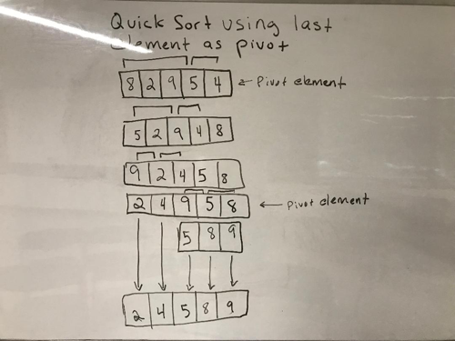

# Lecture Notes: Quick Sort

Quicksort is a divide and conquer algorithm. The algorithm is breifly:  Divides a large array into two smaller sub-arrays, one with the smaller elements and the other with larger elements. Then recursively sort the two smaller arrays.


Quicksort is on average a O(n log n) time. However, for example, always choosing the last element in the array as the pivot may end with O(n - squared). This will happen on already sorted arrays and arrays with identical elements. The same would occur using the first element as the pivot. This can occurr because on a large set of numbers many of the smaller arrays will end up sorted by default or have identical elements.
***

Todays learning objective is to learn how a quick sort works. We will analyze time and space complexity to understand when a merge sort should be used and when it should not. At the end of this lesson the student will know how to pseudo code and code a solution for a merge sort.

- Review diagram with students
- Analyze time complexity
- Analyze space complexity
- Pseudo code solution
- Have student code solution
- have students write tests for happy path and edge cases.


***

Algorithm

QuickSort is a Divide and Conquer algorithm. An element is picked as the pivot point. They can be:

- First element
- Last element
- Random element
- Middle element

Use the pivot to place smaller elements in front of it and/or larger element behind it. Once that is completed split the array and repeat the process untill all elements in array are sorted.
***


Pseudocode

Source: https://canvas.instructure.com/courses/1597100/assignments/11252311
```
ALGORITHM QuickSort(arr, left, right)
    if left < right
        // Partition the array by setting the position of the pivot value 
        DEFINE position <-- Partition(arr, left, right)
        // Sort the left
        QuickSort(arr, left, position - 1)
        // Sort the right
        QuickSort(arr, position + 1, right)

ALGORITHM Partition(arr, left, right)
    // set a pivot value as a point of reference
    DEFINE pivot <-- arr[right]
    // create a variable to track the largest index of numbers lower than the defined pivot
    DEFINE low <-- left - 1
    for i <- left to right do
        if arr[i] <= pivot
            low++
            Swap(arr, i, low)

     // place the value of the pivot location in the middle.
     // all numbers smaller than the pivot are on the left, larger on the right. 
     Swap(arr, right, low + 1)
    // return the pivot index point
     return low + 1

ALGORITHM Swap(arr, i, low)
    DEFINE temp;
    temp <-- arr[i]
    arr[i] <-- arr[low]
    arr[low] <-- temp
```

***

Readings and References
Watch
- https://www.youtube.com/watch?v=Hoixgm4-P4M

Read
- https://www.geeksforgeeks.org/quick-sort/
- https://en.wikipedia.org/wiki/Quicksort
