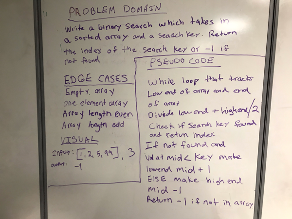

# Challenge Summary
Write a binary search in Java

## Challenge Description
Write a function called BinarySearch which takes in 2 parameters: a sorted array and the search key. Without utilizing any of the built-in Java methods, return the index of the array’s element that is equal to the search key, or -1 if the element does not exist.

## Approach & Efficiency
Use a while loop to continually halve the array, check at the midpoint for search value. If found return the index of the search value. Continue looping and halving array until value is found or return -1 if search value is not in array. This ia a O(lg(n)) solution.

## Code
[See the code](src/main/java/code/challenges/BinarySearch.java)

[See the tests](src/test/java/code/challenges/BinarySearchTest.java)

## Solution
