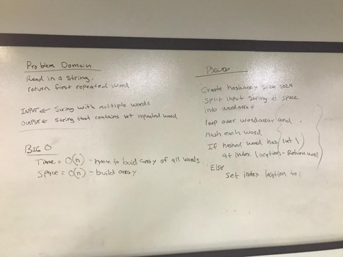

# Challenge Summary

Return the first word to occur more than once in a provided string

## Challenge Description
Write a function that accepts a lengthy string parameter.
Without utilizing any of the JAVA built-in library methods, return the first word to occur more than once in the provided string.
Write at least three test assertions for each method defined.

Example input:
- "Once upon a time, there was a brave princess who..."

Example output:
- "a"

## Approach & Efficiency

The string argument is split into an array causing big O space to be = O(n).
Time is also O(n) even though lookups are O(1) because we may iterate over all the words in the array without finding a duplicate.
 
## Code
[See the RepeatedWord.java class](src/main/java/code/challenges/RepeatedWord.java)

[See the tests](src/test/java/code/challenges/RepeatedWordTest.java)

## Solution

