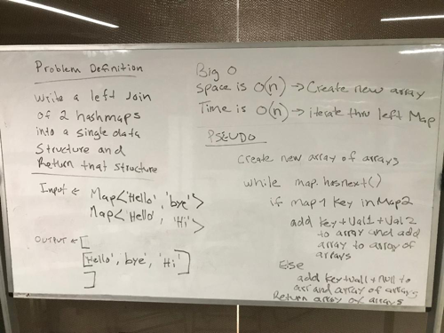

# Challenge Summary

Implement a simplified LEFT JOIN for 2 Hashmaps

## Challenge Description
Write a function that LEFT JOINs two hashmaps into a single data structure.

- The first parameter is a hashmap that has word strings as keys, and a synonym of the key as values.
- The second parameter is a hashmap that has word strings as keys, and antonyms of the key as values.
- Combine the key and corresponding values (if they exist) into a new data structure according to LEFT JOIN logic. LEFT JOIN means all the values in the first hashmap are returned, and if values exist in the “right” hashmap, they are appended to the result row. If no values exist in the right hashmap, then some flavor of NULL should be appended to the result row.
- Return the joined hashmaps.

Example input and output:

## Approach & Efficiency

The maps are converted into an array of arrays for big O space: O(n). The time is O(n) as well as the entire left hash-map is iterated over. 
 
## Code
[See the LeftJoin.java class](src/main/java/code/challenges/LeftJoin.java)

[See the tests](src/test/java/code/challenges/LeftJoinTest.java)

## Solution

