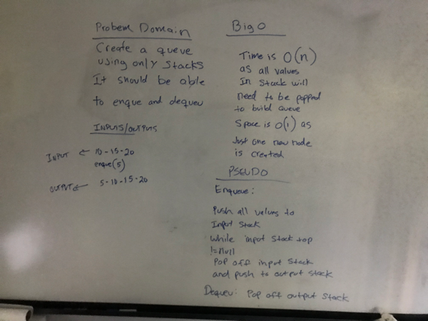

# Challenge Summary
Create a PseudoQueue. Use only stacks to create the queue.

## Challenge Description
Create a brand new PseudoQueue class. Do not use an existing Queue. Instead, this PseudoQueue class will implement our standard queue interface (the two methods listed below), but will internally only utilize 2 Stack objects. Ensure that you create your class with the following methods:

enqueue(value) which inserts value into the PseudoQueue, using a first-in, first-out approach.
dequeue() which extracts a value from the PseudoQueue, using a first-in, first-out approach.
The Stack instances have only push, pop, and peek methods. You should use your own Stack implementation. Instantiate these Stack objects in your PseudoQueue constructor.

## Approach & Efficiency
The method will pop n nodes off of input stack for an O(n) time solution. Space is O(1) as it created just one new node.

## Code
[See the Pseudo Queue Class for code challenge 11](src/main/java/stacksandqueues/PseudoQueue.java)

[See the tests](src/test/java/stacksandqueues/PseudoQueueTest.java)

## Solution
