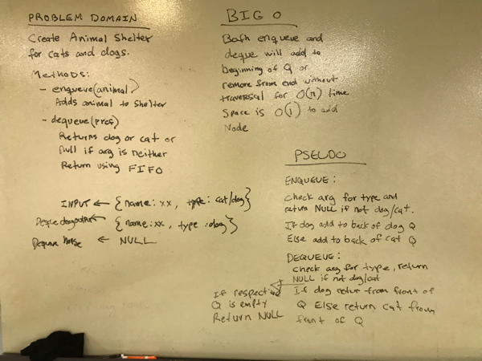

# Challenge Summary
First-in, First out Animal Shelter

## Challenge Description
Create a class called AnimalShelter which holds only dogs and cats. The shelter operates using a first-in, first-out approach.
Implement the following methods:
- enqueue(animal): adds animal to the shelter. animal can be either a dog or a cat object.
- dequeue(pref): returns either a dog or a cat. If pref is not "dog" or "cat" then return null.

## Approach & Efficiency
Enqueue will add dog to back of doq Q or cat to back of cat Q. Time and space are both O(1).
Dequeue will remove and return from front of Q. Time and space are both O(1).

## Code
[See the AnimalShelter.java Class for code challenge 12](src/main/java/fifoAnimalShelter/AnimalShelter.java)

[See the tests](src/test/java/fifoAnimalShelter/AnimalShelterTest.java)

## Solution
There is a typo in big O. Time is O(1) not O(n).
