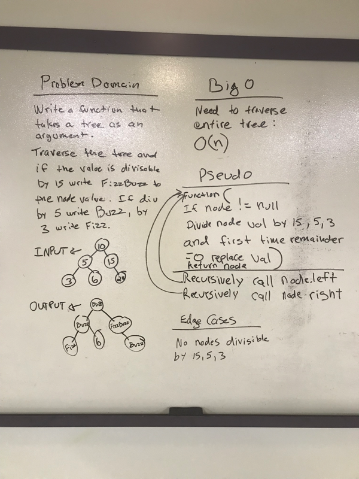

# Challenge Summary
Write a FizzBuzzTree function to change tree values

## Challenge Description
Write a function called FizzBuzzTree which takes a tree as an argument.
Without utilizing any of the built-in methods available to your language, determine weather or not the value of each node is divisible by 3, 5 or both, and change the value of each of the nodes:
- If the value is divisible by 3, replace the value with “Fizz”
- If the value is divisible by 5, replace the value with “Buzz”
- If the value is divisible by 3 and 5, replace the value with “FizzBuzz”
- Return the tree with its new values.

## Approach & Efficiency
The entire tree is traversed to check each node which is O(n) time.

## Code
[See the FizzBuzzTree Class](src/main/java/tree/FizzBuzzTree.java)

[See the tests](src/test/java/tree/FizzBuzzTreeTest.java)

## Solution

