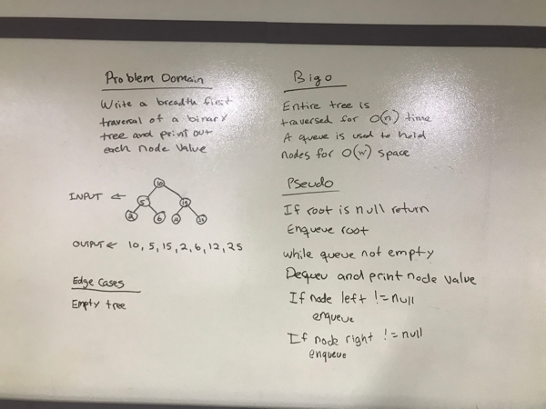

# Challenge Summary
Write a breadth first traversal of a Binary Tree 

## Challenge Description
Traverse the input tree using a Breadth-first approach; print every visited node’s value.

## Approach & Efficiency
The entire tree is traversed to check each node which is O(n) time.
The largest width of the tree is the space complexity at O(w). 

## Code
[See the Binary Tree Class](src/main/java/tree/BinaryTree.java)

[See the tests](src/test/java/tree/BinaryTreeTest.java)

## Solution

