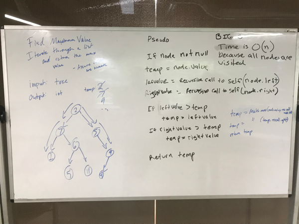

# Challenge Summary
Find the Maximum Value in a Binary Tree

## Challenge Description
Write a function called find-maximum-value which takes binary tree as its only input. Return the maximum value stored in the tree.

## Approach & Efficiency
The entire tree is traversed to check each node which is O(n) time.
No space complexity as node values are temporarily saved in the same primitives.

## Code
[See the Binary Tree Class](src/main/java/tree/BinaryTree.java)

[See the tests](src/test/java/tree/BinaryTreeTest.java)

## Solution

