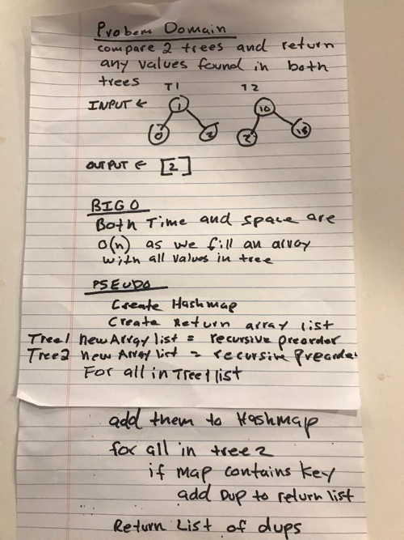

# Challenge Summary
Find common values in 2 binary trees

## Challenge Description
Write a function called tree_intersection that takes two binary tree parameters.
Without utilizing any JAVA built-in library methods, return a set of values found in both trees.

## Approach & Efficiency
Use a hash map to hash all values in first tree. Compare second tree values to values in hash map. When there is a collision add value to array and return array at end of tree.

Have to create array to hold all tree values making space O(n). Time is also O(n) because we have to iterate over array to add all node values to it.

## Code
[See the Binary Tree Class](src/main/java/treeintersection/TreeIntersection.java)

[See the tests](src/test/java/treeIntersection/TreeIntersectionTest.java)

## Solution

