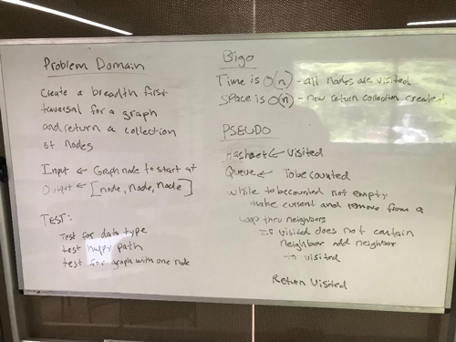

# Challenge Summary
Implement a breadth-first traversal on a graph

## Challenge Description
Extend a graph object with a breadth-first traversal method that accepts a starting node. Without utilizing any of the built-in methods available in Java, return a collection of nodes in the order they were visited. Display the collection.

## Approach & Efficiency

This search uses a Queue and a Hash Set

The time complexity is O(n) as the neighbors collection is iterated over to determine if we have seen a node or not. Space is O(n) as all nodes are added to a new Hash Set.

## Code
[See the BreadthFirst code](src/main/java/graph/Graph.java)

[See the tests](src/test/java/graph/GraphTest.java)

## Solution

