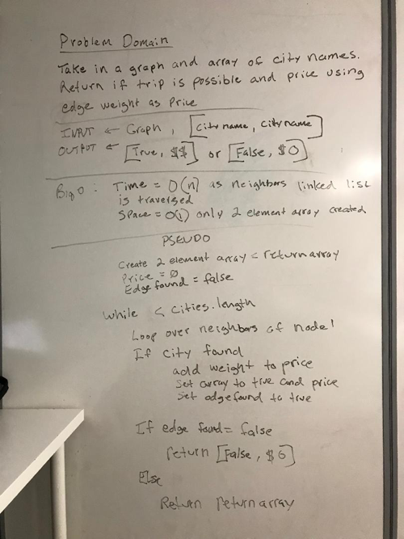

# Challenge Summary
Given a business trip itinerary, and a route map, is the trip possible with direct flights? If so, how much will the total trip cost be?

## Challenge Description
Write a function based on the specifications above, which takes in a graph, and an array of city names. Without utilizing any of the built-in Java methods, return whether the full trip is possible with direct flights, and how much it would cost.

## Approach & Efficiency

Use a for:each construct to check for neighbors in input array and if found get the weight and add weight for each connected city.

Time complexity is O(n) as we loop thru each linkedlist of neighbors. Space is O(1) as only a 2 element array is created and returned.

## Code
[See the getEdges code](src/main/java/graph/Graph.java)

[See the tests](src/test/java/graph/GraphTest.java)

## Solution

