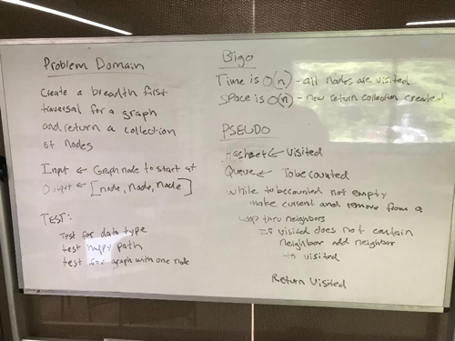

# Challenge Summary
Conduct a depth first preorder traversal on a graph

## Challenge Description
Write a function that accepts an adjacency list as a graph, and conducts a depth first traversal. Without utilizing any of the built-in Java methods, return a collection of nodes in their pre-order depth-first traversal order.

## Approach & Efficiency

This search uses a Linked List

The time complexity is O(n) as the neighbors collection is iterated over to determine if we have seen a node or not. Space is O(n) as all nodes are added to a new Linked List.

## Code
[See the depthFirst code](src/main/java/graph/GraphNode.java)

[See the tests](src/test/java/graph/GraphTest.java)

## Solution

