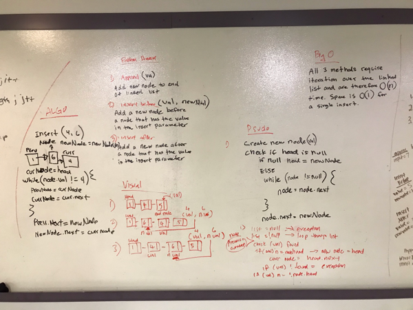

# Challenge Summary
Write append, insertBefore and insertAfter methods for the Linked List class

## Challenge Description
Write 3 new methods for the Linked List class
- .append(value) which adds a new node with the given value to the end of the list
- .insertBefore(value, newVal) which adds a new node with the given newValue immediately before the first value node
- .insertAfter(value, newVal) which adds a new node with the given newValue immediately after the first value node

## Approach & Efficiency
All 3 methods iterate over the linked list, either to get to the end of the list for the append or to find an insert location. All 3 methods are therefore O(n) time solutions. Each method inserts one node for O(1) of space

## Code
[See the Linked List Class for code challenge 06](src/main/java/data/structures/linkedlist/Linkedlist.java)

[See the tests](src/test/java/data/structures/linkedlist/LinkedlistTest.java)

## Solution
