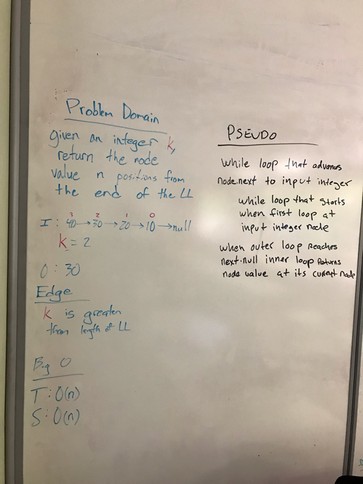

# Challenge Summary
Write a method for the Linked List class which takes an int as a parameter.

## Challenge Description
Write a method for the Linked List class which takes an int, k, as a parameter. Return the node’s value that is k from the end of the linked list.

## Approach & Efficiency
The method iterates over the linked list to find the end of the list for an O(n) time solution. Space is O(1).

## Code
[See the Linked List Class for code challenge 07](src/main/java/data/structures/linkedlist/Linkedlist.java)

[See the tests](src/test/java/data/structures/linkedlist/LinkedlistTest.java)

## Solution
