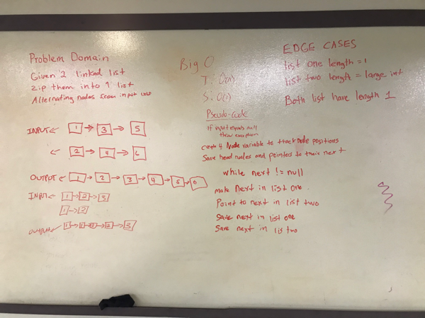

# Challenge Summary
Merge two linked lists.

## Challenge Description
Write a method called mergeLists which takes two linked lists as arguments. Zip the two linked lists together into one so that the nodes alternate between the two lists and return a reference to the head of the zipped list.

## Approach & Efficiency
The method will iterate over the linked lists to merge them together for an O(n) time solution. Space is O(1).

## Code
[See the Linked List Class for code challenge 08](src/main/java/data/structures/linkedlist/Linkedlist.java)

[See the tests](src/test/java/data/structures/linkedlist/LinkedlistTest.java)

## Solution
